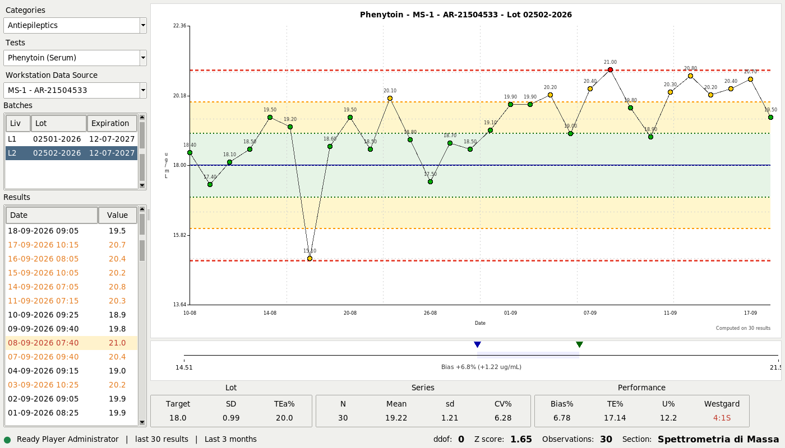

# Biovarase

**One lab, one chart.**

Internal quality control for a single medical laboratory: the analytes it
measures, the lots of control material open on its instruments, the results
run on them, and the Levey-Jennings chart that says whether the method can
report today.



Python 3 with Tkinter and SQLite. Three dependencies, no server, no browser,
and a database that is one file.

## Run it

```
python3 biovarase.py
```

It opens on the sample laboratory that ships with it. Log in as `admin` with
the password `pass`, choose **Antiepileptics**, then **Phenytoin**, then the
first instrument and the second lot — and you are looking at a calibration
that has been drifting for three weeks.

```
python3 biovarase.py --trace     # print what it does, while you use it
python3 -m unittest discover -s tests -v
```

Python 3.7 or later, Tk 8.6, and `openpyxl`, `bcrypt` and `reportlab`
(`pip install -r requirements.txt`). To build an executable for a PC that has
no Python, see [documents/BUILD.md](documents/BUILD.md).

## What it does

**Watches a series.** A lot of control material on one analyte and one
instrument is a series. The chart draws the last thirty results with the
target and the limits at one, two and three standard deviations; the
statistics under it say what the series is doing, and the Westgard multirule
says whether that is a reason to stop.

**Says what kind of wrong.** A rule is broken and the next question is what
sort of error it is. The Youden plot puts the two levels of the same control
against each other — along the diagonal is a calibration, scattered is
imprecision. The total error chart puts what the method does against what the
analyte allows. The Bland-Altman plot compares two instruments on the same
control, which is the question of the morning a new one arrives.

**Keeps the record.** Every result entered, corrected, excluded or moved is
written to an audit trail by triggers in the database, with the values as
they were, who did it and when. Nothing is deleted: a wrong value is
corrected, a result on the wrong lot is moved, a duplicate is excluded with a
reason, and each of those leaves a trace. The day's controls print as a PDF
with the laboratory, the operator, the version of the program and the
statistical settings on it — a record that can say where it came from.

**Knows what it is held to.** Every method carries its analytical goals.
Where the analyte has a biological variation of its own the goals follow from
it by the EFLM formulae; where it has none — a drug's concentration is what
the dose made it — the goal is the state of the art, typed in as an allowable
total error. See [documents/ANALYTICAL_GOALS.md](documents/ANALYTICAL_GOALS.md).

## The sample data

`sql/biovarase.sl3` is a laboratory that never existed, run by people who are
no longer here to mind: Francis Aston, Hans Krebs, Maud Menten, Leonor
Michaelis, Rosalyn Yalow, Archibald Garrod.

What it measures is real, and so are the concentrations: therapeutic drug
monitoring, immunosuppressants, steroid hormones, vitamins, catecholamines,
alcohol markers and drugs of abuse, on two mass spectrometers, a
chromatograph and a gas chromatograph with a headspace sampler — 44 analytes,
56 methods over seven matrices, 133 lots, 8348 results over six months.

Four series have something wrong with them, because a program for quality
control whose sample data is all in control teaches nothing: a calibration
drifting on the phenytoin, a mean that moved and stayed there on the
tacrolimus, imprecision quietly getting worse on the lamotrigine, one bad
morning on the valproic acid. They come out as `4:1S`, `10:X` and `1:2S`,
with the notes that were written about them.

Everybody's password is `pass`.

```
rm sql/biovarase.sl3
sqlite3 sql/biovarase.sl3 < sql/biovarase.sql     # build it again
sqlite3 -init sql/console.sql sql/biovarase.sl3   # look inside it
```

## What is worth reading

**The charts are drawn by hand.** Six canvases, no plotting library:
Levey-Jennings with the bands and the points beyond four standard deviations
clipped as triangles, Youden, total error, Bland-Altman, the bias bar, the
frequency histogram. Each one is a few hundred lines of lines, arcs and text
on a `tk.Canvas`.

**The audit trail is triggers.** Six of them, in
[sql/ddl/001_schema.sql](sql/ddl/001_schema.sql). SQLite has no
`CURRENT_USER`, so the login writes who is working into a one-row `session`
table and the triggers read it from there — in the open, where it can be
read.

**Written by hand where it teaches.** The log, the settings reader, the
Observer, the register of open windows: each one a short class, where the
standard library has a module that would do it. `logging`, `configparser` and
the rest are named in the docstrings, so what they do underneath can be seen
in forty lines.

**Composition, not inheritance.** The engine owns a db, a log, the settings,
the statistics, the rules, the exporter and the windows, and is none of them:
`engine.db.read(...)`, `engine.qc.get_mean(...)`. A call says who does the
work.

105 tests, `unittest` from the standard library, a database in memory.

[documents/USER_MANUAL.md](documents/USER_MANUAL.md) is the program as it is
used, with a picture of every window: the day's work, the rules and what
each chart answers, the records that get signed, and what the settings
change. It ships as a PDF too, and the **?** menu opens it.

Three documents go with the code:
[ARCHITECTURE.md](ARCHITECTURE.md), how it is built and why;
[HOW_IT_WORKS.md](HOW_IT_WORKS.md), the program followed while it runs — the
start, a login, a chart, a result entered, an error;
[CONVENTIONS.md](CONVENTIONS.md), the rules it is written by.

## Layout

| | |
|---|---|
| `biovarase.py` | the entry point, and nothing else |
| `ui/` | the windows, one class per file |
| `engine.py` | what everything reaches |
| `dbms.py`, `qc.py`, `westgards.py` | the database, the statistics, the rules |
| `exporter.py`, `report.py` | the sheets, and the form that gets signed |
| `*_canvas.py`, `ljcanvas.py` | the charts |
| `sql/` | the schema, the queries, the sample database |
| `tests/` | 105 of them |
| `documents/` | the manual, the analytical goals, how to build it |

## Licence

GNU GPL, version 3 or later. See [LICENSE](LICENSE).

Giuseppe Costanzi — biomedical laboratory technician, mass spectrometry
section, and the person this was written for.
