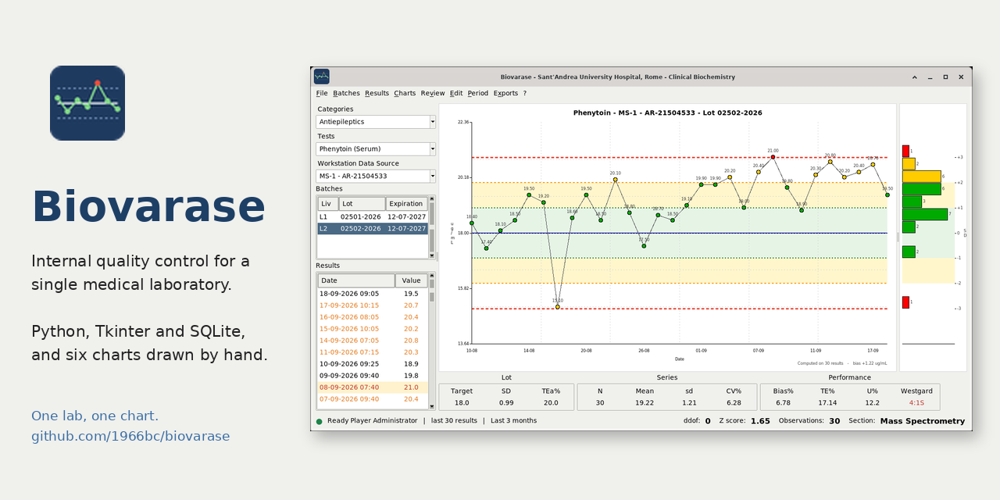

# Biovarase

[](https://www.python.org/downloads/)
[](https://docs.python.org/3/library/tk.html)
[](https://www.sqlite.org/index.html)
[](https://www.iso.org/standard/76677.html)
[](LICENSE)

**One lab, one chart.**

Internal quality control for a single medical laboratory: the analytes it
measures, the lots of control material open on its instruments, the results
run on them, and the Levey-Jennings chart that says whether the method can
report today.



Python 3 with Tkinter and SQLite. Three dependencies, no server, no browser,
and a database that is one file.

## Run it

```
python3 biovarase.py
```

It opens on the sample laboratory that ships with it. Log in as `admin` with
the password `pass`, choose **Antiepileptics**, then **Phenytoin**, then the
first instrument and the second lot — and you are looking at a calibration
that has been drifting for three weeks.

```
python3 biovarase.py --trace     # print what it does, while you use it
python3 -m unittest discover -s tests -v
```

Some of the tests open the real windows, so they want a display. On a
desktop they flash past while they run, and on a machine with no screen at
all they are skipped; `xvfb-run -a python3 -m unittest discover -s tests`
gives them one of their own and does neither.

Python 3.7 or later, Tk 8.6, and `openpyxl`, `bcrypt` and `reportlab`
(`pip install -r requirements.txt`). To build an executable for a PC that has
no Python, see [documents/BUILD.md](documents/BUILD.md).

## Where the database lives

The whole laboratory is one SQLite file, and `biovarase.ini` says which one.
**File > Configuration file** opens that in whatever the system uses for
text, so it can be found without hunting for the folder the program was
installed in.

```ini
[database]
file = sql/biovarase.sl3
```

A bare name is taken beside the program, wherever it was started from. An
absolute path is taken as it is:

```ini
file = /home/gc/laboratory/biovarase.sl3      ; another disk
file = /mnt/lab/qc/biovarase.sl3              ; a mounted share
file = Z:\lab\qc\biovarase.sl3               ; a drive on Windows
```

It is read once, at start-up, so a change takes effect the next time the
program is started. **? > About** prints the path it actually opened, which
is the thing to check when two computers disagree about what is in the
database.

To start a laboratory of its own rather than the sample one, build an empty
database from the schema and point the file at it:

```
sqlite3 mylab.sl3 < sql/ddl/001_schema.sql
sqlite3 mylab.sl3 < sql/dml/001_master_data.sql
```

`sql/starter/biovarase.sl3` is that, already built: the schema and the
master data, one administrator, and no results.

**A shared folder is where this gets interesting.** A section with four
benches wants one file all four can reach, and SQLite's own documentation
advises against putting it on SMB or NFS: file locking over a network is not
reliable, and two machines writing at the same moment can leave a corrupted
file with nothing to warn either of them. It is nevertheless how a small
laboratory works, and the program is built for it — the lamp in the status
bar goes red within thirty seconds of the share going away, **File >
Database > Backup** is one keystroke, and **Check** asks the database
whether it is still sound. Take the backup every day and keep more than one.

## What it does

**Watches a series.** A lot of control material on one analyte and one
instrument is a series. The chart draws the last thirty results with the
target and the limits at one, two and three standard deviations; beside it,
on the same vertical scale, the profile counts how many fell in each half
deviation — the chart says when, the profile says how often, and a series
that has quietly moved shows as a lopsided pile before any rule fires. The
statistics under them say what the series is doing, and the Westgard
multirule says whether that is a reason to stop.

**Says what kind of wrong.** A rule is broken and the next question is what
sort of error it is. The Youden plot puts the two levels of the same control
against each other — along the diagonal is a calibration, scattered is
imprecision. The total error chart puts what the method does against what the
analyte allows. The Bland-Altman plot compares two instruments on the same
control, which is the question of the morning a new one arrives.

**Asks somebody else.** Internal control answers whether the method is doing
today what it did yesterday, and nothing more: the target it is judged
against is the laboratory's own, so a method can sit in control for six
months on a mean that moved. The proficiency rounds are the other half — the
same sample to everybody, the value assigned from outside, and a z score for
each analyte. Two scores read a whole round at once: **RSZ**, which keeps the
sign and so sees a laboratory that reads high on everything, and **SZ2**,
which squares and so sees how far out it was whichever way. The sample
database has a round where every single analyte is satisfactory and the round
is not, which is the case neither a chart nor a single z can find.

**Keeps the record.** Every result entered, corrected, excluded or moved is
written to an audit trail by triggers in the database, with the values as
they were, who did it and when. Nothing is deleted: a wrong value is
corrected, a result on the wrong lot is moved, a duplicate is excluded with a
reason, and each of those leaves a trace. The day's controls print as a PDF
with the laboratory, the operator, the version of the program and the
statistical settings on it — a record that can say where it came from.

**Knows what it is held to.** Every method carries its analytical goals.
Where the analyte has a biological variation of its own the goals follow from
it by the EFLM formulae; where it has none — a drug's concentration is what
the dose made it — the goal is the state of the art, typed in as an allowable
total error. See [documents/ANALYTICAL_GOALS.md](documents/ANALYTICAL_GOALS.md).

## The sample data

`sql/biovarase.sl3` is a real laboratory with invented numbers in it: the mass
spectrometry section of the Clinical Biochemistry and Molecular Biology Unit
at Sant'Andrea University Hospital in Rome, as it is actually set up. The
panels are the ones it reports, the matrices are the ones it receives, the
instruments are the ones on the bench and the methods are the ones written in
its procedures — therapeutic drug monitoring, immunosuppressants, steroid
hormones, vitamins, catecholamines, alcohol markers and drugs of abuse, on two
mass spectrometers, a chromatograph and a gas chromatograph with a headspace
sampler. 44 analytes, 56 methods over six matrices, 133 lots, 8348 results
over six months, and four proficiency schemes with eight rounds of them.

What is invented is the data. The concentrations are the ones those analytes
are actually controlled at and the lots behave as lots behave, but no result
in that file was measured: they were generated, so that a database could be
published without publishing a laboratory's own. The people are invented
too, and are people who are no longer here to mind: Francis Aston, Hans
Krebs, Maud Menten, Leonor Michaelis, Rosalyn Yalow, Archibald Garrod.

Four series have something wrong with them, because a program for quality
control whose sample data is all in control teaches nothing: a calibration
drifting on the phenytoin, a mean that moved and stayed there on the
tacrolimus, imprecision quietly getting worse on the lamotrigine, one bad
morning on the valproic acid. They come out as `4:1S`, `10:X` and `1:2S`,
with the notes that were written about them. Three results were corrected and
one was withdrawn as a duplicate, so the audit trail has something to show;
and of the eight proficiency rounds, one has every analyte inside two
standard deviations and an RSZ of 4.26.

Everybody's password is `pass`.

```
rm sql/biovarase.sl3
sqlite3 sql/biovarase.sl3 < sql/biovarase.sql     # build it again
sqlite3 -init sql/console.sql sql/biovarase.sl3   # look inside it
```

## What is worth reading

**Her Majesty `tk.Canvas`.** Six charts and not one plotting library:
Levey-Jennings with its bands and its points beyond four standard deviations
clipped as triangles, the profile that stands beside it on the same scale,
Youden, total error, Bland-Altman, the frequency histogram. Lines,
rectangles, polygons and text, on a widget that
has been in the standard library since Tk itself and will draw anything at
all for anyone willing to work out the coordinates. Working them out is the
interesting part: a chart is a scale, a margin and two axes, and once those
are written down the picture is twenty lines. What it costs is three
dependencies instead of thirty, and a program that opens instantly on a slow
machine.

**The audit trail is triggers.** Six of them, in
[sql/ddl/001_schema.sql](sql/ddl/001_schema.sql). SQLite has no
`CURRENT_USER`, so the login writes who is working into a one-row `session`
table and the triggers read it from there — in the open, where it can be
read.

**Written by hand where it teaches.** The log, the settings reader, the
Observer, the register of open windows: each one a short class, where the
standard library has a module that would do it. `logging`, `configparser` and
the rest are named in the docstrings, so what they do underneath can be seen
in forty lines.

**Composition, not inheritance.** The engine owns a db, a log, the settings,
the statistics, the rules, the exporter and the windows, and is none of them:
`engine.db.read(...)`, `engine.qc.get_mean(...)`. A call says who does the
work.

136 tests, `unittest` from the standard library, a database in memory.

[documents/USER_MANUAL.md](documents/USER_MANUAL.md) is the program as it is
used, with a picture of every window: the day's work, the rules and what
each chart answers, the records that get signed, and what the settings
change. It ships as a PDF too, and the **?** menu opens it.

Three documents go with the code:
[ARCHITECTURE.md](ARCHITECTURE.md), how it is built and why;
[HOW_IT_WORKS.md](HOW_IT_WORKS.md), the program followed while it runs — the
start, a login, a chart, a result entered, an error;
[CONVENTIONS.md](CONVENTIONS.md), the rules it is written by.

## Layout

| | |
|---|---|
| `biovarase.py` | the entry point, and nothing else |
| `ui/` | the windows, one class per file |
| `engine.py` | what everything reaches |
| `dbms.py`, `qc.py`, `westgards.py` | the database, the statistics, the rules |
| `eqa.py` | the z score, and the two that read a whole round |
| `exporter.py`, `report.py` | the sheets, and the form that gets signed |
| `*_canvas.py`, `ljcanvas.py` | the charts |
| `sql/` | the schema, the queries, the sample database |
| `tests/` | 136 of them |
| `documents/` | the manual, the analytical goals, how to build it |

## Licence

GNU GPL, version 3 or later. See [LICENSE](LICENSE).

Giuseppe Costanzi — biomedical laboratory technician, mass spectrometry
section, and the person this was written for.
