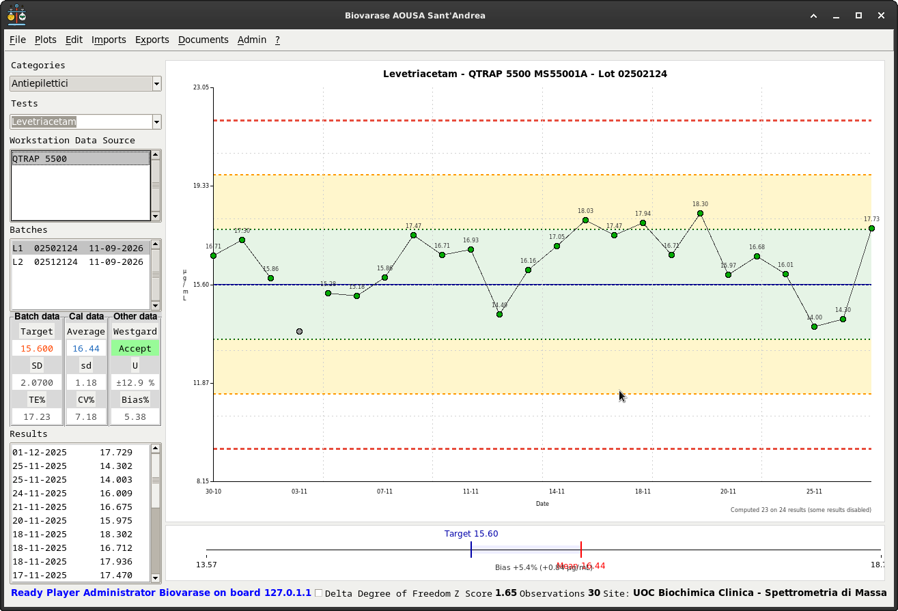

# Biovarase

**Professional Quality Control Management System for Medical Laboratories**

Biovarase is a comprehensive QC (Quality Control) management application designed for medical laboratories, implementing ISO 15189:2022 standards and Westgard multirule algorithms for analytical quality monitoring.

[](https://www.python.org/)
[](./LICENSE)

---



---

## Features

### Core Functionality
- **Westgard Multirule QC** - Statistical process control (1:3S, 2:2S, R:4S, 4:1S, 10:X)
- **QC Statistical Analysis** - Mean, SD, CV%, Bias, Total Error, Sigma metrics
- **Measurement Uncertainty** - ISO/TS 20914:2019 compliant calculations
- **Levey-Jennings Charts** - Visual QC trending and analysis
- **Batch Management** - QC material tracking and expiry monitoring

### Security & Compliance
- **Hardware-Locked Encryption** - AES-256-GCM config encryption tied to machine
- **Bcrypt Password Hashing** - Cost factor 12 for secure authentication
- **Role-Based Access Control** - Admin, Superuser, Technician, Viewer roles
- **Audit Logging** - Complete activity tracking
- **ISO 15189:2022 Compliance** - Medical laboratory quality standards

### Technical Features
- **Cross-Platform** - Linux and Windows 10/11 support
- **MariaDB Backend** - Robust relational database
- **Tkinter GUI** - Native desktop interface
- **Automated Testing** - 731 tests with pytest infrastructure
- **Log Rotation** - Automatic log management (10MB limit, 5 file retention)

---

## 🚀 Quick Start

### Prerequisites

- **Python**: 3.7 or higher
- **MariaDB**: 10.3 or higher
- **OS**: Linux (tested on Debian/Ubuntu) or Windows 10/11

### Installation

1. **Clone Repository**
   ```bash
   git clone <repository-url>
   cd biovarase
   ```

2. **Create Virtual Environment**
   ```bash
   python3 -m venv venv
   source venv/bin/activate  # Linux/Mac
   # or
   venv\Scripts\activate     # Windows
   ```

3. **Install Dependencies**
   ```bash
   pip install -r requirements.txt
   ```

4. **Setup Database**
   ```bash
   # Import database schema
   mysql -u root -p < biovarase.sql
   ```

5. **First Run**
   ```bash
   python3 biovarase.py
   ```

   On first run, the Setup Wizard will guide you through:
   - Database connection configuration
   - Admin user creation
   - Hardware-locked encryption setup

### Default Credentials

After initial setup, use the credentials you created during the wizard.

**Generic Viewer Account** (autologin):
- Username: `viewer`
- Password: `viewer`
- Role: Read-only access

---

## Usage

### Launching the Application

```bash
# Standard launch
python3 biovarase.py
```

### Basic Workflow

1. **Login** - Authenticate with user credentials
2. **Select Site/Lab/Section** - Choose your working context
3. **Manage Batches** - Create/edit QC material batches
4. **Enter Results** - Input QC measurements
5. **Review QC Charts** - Analyze Levey-Jennings plots
6. **Validate Results** - Apply Westgard rules for run acceptance
7. **Generate Reports** - Export QC data and statistics

### User Roles

- **App Admin (role=0)**: Full system access, global master data
- **Country Admin (role=1)**: Country-level administration
- **Regional Admin (role=2)**: Region-level administration
- **Lab Admin (role=3)**: Lab configuration, user management
- **Superuser (role=4)**: QC validation, batch management
- **Technician (role=5)**: Data entry only
- **Viewer (role=6)**: Read-only access

---

## 🏗️ Architecture

### Technology Stack

- **Language**: Python 3.7+
- **GUI Framework**: Tkinter (ttk themed widgets)
- **Database**: MariaDB 10.3+ (via mariadb connector)
- **Encryption**: Fernet (AES-128-CBC + HMAC-SHA256)
- **Password Hashing**: bcrypt (cost factor 12)
- **Testing**: pytest 6.0+

### Design Pattern

Biovarase uses a **Mixin Architecture** pattern:

```python
class Engine(DBMS, Controller, QC, Westgards, Exporter, Importer, Launcher, Tools):
    """Main application engine combining all functionality via mixins."""
    pass
```

**Mixin Responsibilities**:
- `DBMS`: Database connection and query execution
- `Controller`: SQL builders and domain logic
- `QC`: Statistical calculations (mean, SD, CV, bias, etc.)
- `Westgards`: Westgard multirule algorithms
- `Exporter`: Data export functionality
- `Importer`: Data import functionality
- `Launcher`: Window management
- `Tools`: GUI utilities and helpers

For detailed architecture documentation, see **[CLAUDE.md](./CLAUDE.md)**.

---

## 📊 Standards Compliance

Biovarase implements the following international standards:

- **ISO 15189:2022** - Medical laboratories - Requirements for quality and competence
- **ISO/TS 20914:2019** - Medical laboratories - Practical guidance for estimation of measurement uncertainty
- **Westgard Multirule QC** - Statistical process control per Westgard JO. Basic QC Practices, 4th Edition. 2016

---

## 🔒 Security

### Encryption

- **Hardware-Locked Configuration**: Config files encrypted with hardware-specific key (MAC + machine-id)
- **Algorithm**: Fernet (AES-128-CBC + HMAC-SHA256)
- **Key Derivation**: PBKDF2-HMAC-SHA256 (100,000 iterations)
- **Non-Transferable**: Encrypted config only works on the machine that created it

### Password Security

- **Hashing**: bcrypt with cost factor 12
- **Salt**: Automatic random salt per password
- **Timing Attack Protection**: bcrypt's constant-time comparison

### Database Security

- **Parameterized Queries**: All SQL queries use placeholders (SQL injection prevention)
- **Input Validation**: SQL identifier validation with regex patterns
- **Connection Timeout**: 5-second timeout for database connections

---

## 🛠️ Development

### Project Structure

```
biovarase/
├── views/            # GUI windows and dialogs
│   ├── login.py      # Login window
│   ├── main.py       # Main application window
│   └── ...
├── engine.py         # Main Engine class (mixin orchestrator)
├── dbms.py           # Database connection and queries
├── controller.py     # SQL builders and domain logic
├── qc.py             # QC statistical calculations
├── westgards.py      # Westgard rule algorithms
├── tools.py          # GUI utilities
├── biovarase.py      # Application entry point
└── schema.sql        # Database schema
```

### Building Executable (Windows)

```cmd
build_biovarase.cmd
```

Output: `dist/biovarase.dist/biovarase.exe`

### Coding Standards

- **Python Version**: 3.7+ (maintain backward compatibility)
- **Style**: Follow PEP 8
- **Docstrings**: English, Google-style format
- **Comments**: English only
- **Type Hints**: Preferred but not required (Python 3.7 compatible)
- **Testing**: Pytest with fixtures and markers

For detailed coding guidelines, see **[CLAUDE.md](./CLAUDE.md)**.

---

## License

This project is licensed under the **GNU General Public License v3.0**.

See [LICENSE](./LICENSE) file for details.

---

## Acknowledgments

- **Westgard QC** - For statistical process control methodologies
- **ISO/TC 212** - For medical laboratory standards
- **Python Community** - For excellent tools and libraries

---

## Author

**Giuseppe Costanzi (1966bc)**
- Email: giuseppecostanzi@gmail.com
- Project: Biovarase Professional Edition v4.2
