# What this program is

Biovarase keeps the internal quality control of one laboratory: the analytes
it measures, the lots of control material open on its instruments, the
results run on them, and the Levey-Jennings chart that says whether a method
can report today.

It is a desktop program. It needs no server and no browser, and its database
is a single file. One person can run it on one computer; a small section can
put the file on a shared folder and work on it from the few benches that
need it.

What it is **not**: it is not a LIS, it does not hold patient results, and it
does not decide anything on its own. It computes what the standards ask for,
draws it, and says which rule was broken. What to do about that is the
laboratory's judgement, and the program only records it.

This manual is written for the person at the bench. It follows the work:
logging in, looking at a series, entering the morning's control, saying what
was done about a result that came out wrong, and printing the record at the
end of the day. The last chapters are for whoever keeps the master data and
the database.

The program that goes with this manual is version 5. The **?** menu, under
**About**, says which version is actually running, which Python it is running
on and where its database file is.

# Getting started

## Installing

Python 3.7 or later with Tk 8.6, and three libraries:

```
pip install -r requirements.txt
```

`openpyxl` writes the spreadsheets, `reportlab` the PDF records, `bcrypt`
hashes the passwords. Everything else is the standard library.

On a computer with no Python, the program is built into a single folder that
runs on its own: see [BUILD.md](BUILD.md).

## Starting it

```
python3 biovarase.py
```

The database, the log and the settings live beside the program, so it can be
started from any folder. A shortcut on the desktop is the usual way.

To watch what it does while you use it, start it with the trace. The terminal
then prints, line by line, what the program is doing and what its variables
hold. It is useful when something goes wrong and worth seeing once in any
case:

```
python3 biovarase.py --trace
```

## Logging in

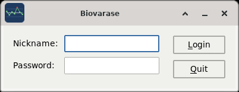

A nickname and a password, and three tries. The message does not say which of
the two was wrong.

The login is not decoration: it writes into the database who is working, and
every result entered, corrected or excluded from then on is recorded under
that name. A shared account makes the audit trail say nothing.

The program ships with a sample laboratory. Log in as `admin` with the
password `pass`; the other users have the same one until it is changed.
Change it - **File > Change password** - the first time the program is used
on real data.

# The main window

Everything begins here. The left column narrows the question one step at a
time; the right shows the answer.

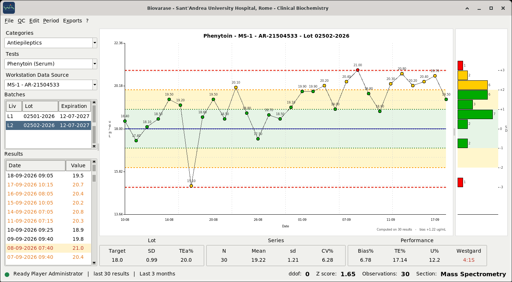

## The four choices

**Categories** is the panel - Antiepileptics, Steroid hormones, Drugs of
abuse. **Tests** is the analyte in it, with the matrix in brackets: cocaine
in urine and cocaine in keratin are one analyte and two methods, and the
brackets are what keeps them apart.

**Workstation Data Source** is the instrument. Only the instruments that have
a lot open on the analyte chosen appear.

**Batches** are the lots of control material open on that analyte and that
instrument, with the level (L1, L2), the lot number and the expiration date.
A lot past its expiration is shown in red - it still works, and the program
says so rather than hiding it.

Choosing a lot fills the rest of the window.

## The chart

The Levey-Jennings chart draws the last thirty results - the number is in
**File > Settings** - with the target as a solid line and dashed limits at
one, two and three standard deviations. Green under 2 SD, orange between 2
and 3, red beyond 3. A point further than four standard deviations is drawn
as a triangle at the edge, so one absurd value does not flatten the scale of
everything else.

The bottom of the chart is dated, not numbered. A control chart is read to
answer *when* something started going wrong, and a series numbered 1 to 30
cannot answer that.

Under the chart, one line says how many of the points drawn the statistics
were computed on - `Computed on 30 results`, or `Computed on 28 of 30
results, 2 excluded`. A series of thirty where two were excluded is not a
series of thirty, and whoever reads the mean has a right to know first.

**Double clicking a point opens the result behind it.**

## The bias bar

The bar under the chart puts the target and the mean of the series on the
same line and writes the distance between them, in per cent and in the unit
of the method. It answers one question - how far off, and in which direction
- that the chart answers only by eye.

## The three boxes

| Box | What it holds |
|---|---|
| **Lot** | Target, SD and allowable total error: what the box of control material says, and what the analyte is held to |
| **Series** | N, mean, SD and CV%: what this laboratory actually got |
| **Performance** | Bias%, TE%, U% and the Westgard rule: the two put against each other |

They are three boxes and not eight numbers in a row because a target and a
mean look alike, and a laboratory that compares a target with a target does
not find out for months.

**Westgard** is the cell that asks for something to be done. Green `Accept`,
red for any rule broken, grey `NED` when there are not enough results yet.

## The results list

The results of the lot, newest first. The colours say what the row is:

| Colour | Meaning |
|---|---|
| black | within 2 SD |
| orange | beyond 2 SD |
| red | beyond 3 SD |
| grey | excluded from the statistics |
| yellow background | a note was written about it |

**Double clicking a result opens its note** - what is usually wanted of a
result already entered is to say what was done about it.

**The right button** opens a small menu with **Edit result** and **Note**. It
is the way to reach a result older than the thirty points drawn, and above
all an excluded one, which has to be opened again to be put back.

## The status bar

Who is logged in, how many results the chart holds, and the period the lists
and comparisons use. On the right, the numbers the program computes with -
degrees of freedom, coverage factor, observations - and the section.

They are shown there on purpose. A mean read with ddof 0 and one read with
ddof 1 are different numbers, and a total error computed at z 1.65 is not the
one computed at z 1.96. Whoever reads a number off this window can see, in
the same glance, what it was computed with.

The **lamp** on the left is the database. Green means a statement was
answered a moment ago; the question is asked every thirty seconds. It turns
red when the database cannot be reached - which matters when the file lives
on a shared folder, because a network folder goes away without telling
anybody, and without the lamp the first save of the morning would be the one
to find out.

# The day's work

## The controls of a bench, in one pass

**QC > Enter a day**. This is the form the morning is done from.

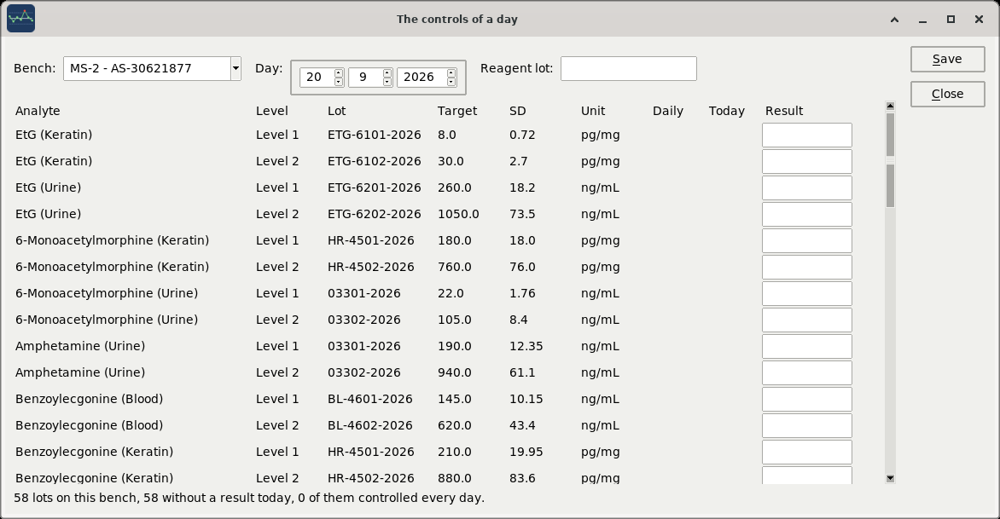

Choose the **bench** and the **day** - it opens on today - and every lot open
on that instrument is listed, with what it is, what it is worth, and a box to
type the result into. **Tab** goes down the column. **Save** writes the boxes
that were filled in and leaves the rest alone: an empty box is a control that
was not run, not a result of zero.

**Reagent lot** at the top is written on every result saved in that pass. A
bench that runs its controls together usually runs them on one reagent lot,
and typing it once is the difference between recording it and not.

Two columns answer the question this window is really for:

**Daily** marks the lots the laboratory has said it controls every working
day - the **Every day** box of the test method. **Today** says how many
results that lot already has on the day chosen. The line at the bottom adds
them up: *58 lots on this bench, 12 without a result today, 4 of them
controlled every day.* Those four are the ones to go and do.

After saving, the boxes empty and the counts are read again, so the same
morning cannot be entered twice by pressing Save twice.

## Entering a single result

Choose the lot, then **double click it** in the Batches list. Or **QC > Add
result**. This is the way in when a result is added later, or on a lot that
belongs to a bench other than the one being worked through.

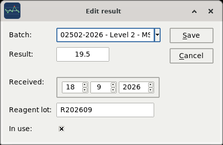

**Result** is the value. A comma is accepted for the decimal point, here and
in the day form.

**Save** saves. It does not ask: pressing it is the answer, and nothing here
is destroyed by saving - a correction keeps what the value was, in the audit
trail. The program asks before three things only: leaving it, rebuilding the
database file, and replacing the target and SD of a lot.

**Received** is the day the control was run. It opens on today. The time is
the moment the result is entered; a result corrected later keeps the time it
was run at, because that is when the control was measured and the chart is
drawn in that order.

**Reagent lot** is free text, and is worth filling in. When a series changes
level, the first question is whether the reagent changed with it, and the
answer is either written here or gone. Left empty it records `NOT ASSIGNED`.

**In use** is what keeps the result in the statistics. See below.

## Correcting a result

Right button on the result, **Edit result**; or double click its point on the
chart.

The value it had before is kept in the audit trail, written by the database
itself. Nothing is hidden by a correction, and nobody has to remember to keep
it that way.

## Nothing is deleted

There is no delete in this program. What happened, happened, and a record
that can be made to say otherwise is not a record. A result that should not
count has three answers, and which one is right depends on what actually
occurred:

**It was typed wrong.** Correct it. The old value stays in the audit trail.

**It was entered on the wrong lot.** Open it and change the **Batch** box -
it offers the other lots of the same analyte, on any instrument. The result
moves; it is not deleted and entered again.

**It was measured and it is not usable** - the sample was wrong, the run was
repeated, the value is a duplicate. Open it and clear **In use**. The point
stays on the chart in grey, with the line broken around it, and comes out of
the statistics. Write a note saying why.

To put an excluded result back: right button on the grey row in the results
list, **Edit result**, tick **In use** again. The chart also reaches it - a
grey point is still a point and can be double clicked - but the list is the
reliable way, because an excluded result may have scrolled out of the thirty
drawn.

## Writing a note

Double click the result, or right button and **Note**.

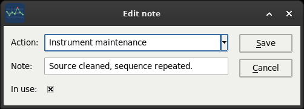

**Action** is what was done, from the list the laboratory keeps -
recalibration, instrument maintenance, new reagent lot, repeated and in
control, non conformity opened. **Note** is the sentence that says it in
words.

A noted result shows with a yellow background in the results list, and the
note appears in **QC > Notes** and in the day's record.

This is what a rule broken is supposed to produce. The chart says the
control is out; the note says what was found and what was done, and that is
the part an assessor reads.

# Opening a new lot

**QC > Batches**. The left list is every analyte in use, narrowed by panel;
the right list is the lots of the one selected, with target, SD, expiration
and how many results each holds.

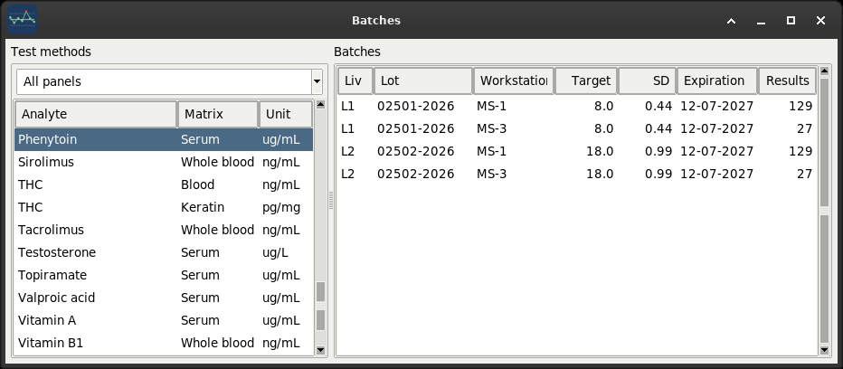

**Double click an analyte** to open a new lot on it. **Double click a lot**
to edit it.

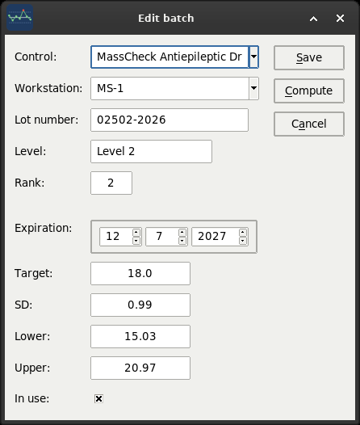

**Control** is the material - the manufacturer's product, from the master
data. **Workstation** is the instrument this lot is running on: the same box
used on two instruments is two lots here, because the two instruments do not
give the same numbers and must not share a chart.

**Lot number**, **Level** and **Rank** identify it. Rank is the order the
levels are shown in, 1 for the low level, 2 for the high one.

**Target** and **SD** are the values the chart is drawn against. At the start
they are what the insert of the box says. **Lower** and **Upper** are the
limits the insert gives, kept for reference.

**Compute** replaces target and SD with the mean and standard deviation of
the results actually obtained - what the instrument does with this material,
rather than what the box says it should. It refuses until the lot has as many
results as the settings ask for, it shows the old and new values before
changing anything, and it fills the fields rather than saving, so the numbers
are seen before they become the limits everything is judged against.

When a lot is finished, clear **In use**. It stops appearing in the main
window and keeps its results and its history.

# Reading the control

## The Westgard rules

The rule in the Performance box is read on the last results of the series -
thirty by default, from **File > Settings**. The rules are evaluated in
order, and the first one broken is the one reported.

| Rule | What it says | What it usually means |
|---|---|---|
| **1:3S** | one result beyond 3 SD | reject the run |
| **2:2S** | two consecutive beyond 2 SD on the same side | systematic error |
| **R:4S** | two consecutive 4 SD apart | random error, imprecision |
| **4:1S** | four consecutive beyond 1 SD on the same side | a shift beginning, or a drift |
| **10:X** | ten consecutive on the same side of the mean | a bias that has settled in |
| **1:2S** | one result beyond 2 SD | warning: look, do not necessarily stop |
| **Accept** | none of the above | in control |

`NED` - not enough data - means the series is shorter than the number of
observations the settings ask for. It is neither good news nor bad, and it
should not be read as either: a lot opened last week has not been in control
yet, because it has not been anything yet.

## What kind of wrong

A rule is broken and the next question is what sort of error it is. Four
windows answer it, all under the **QC** menu and all about the series on
screen.

### Statistics

**QC > Statistics** shows what the main window has no room for.

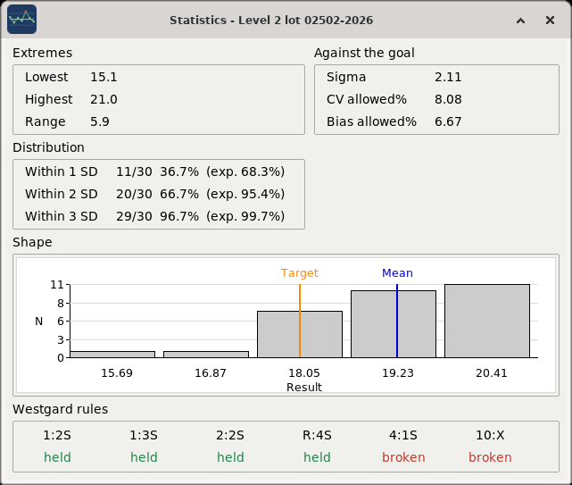

**Extremes** - lowest, highest, range.

**Against the goal** - the sigma metric of the method, and the imprecision
and bias the analyte allows. A sigma above 6 is a method that can be
controlled with few rules; below 3 it will break rules whatever is done to
it, and the answer is not in this program.

**Distribution** - how many of the results fall within 1, 2 and 3 SD, with
what a normal distribution would give. 68.3, 95.4, 99.7 are the expected
figures. A series much tighter than expected is as much of a finding as one
much wider.

**Shape** - the histogram of the results, with the target and the mean drawn
on it. Two humps is the shape of a series that shifted; a long tail on one
side is the shape of something else.

**Westgard rules** - all six, each one held or broken. The main window
reports the first rule broken; this says whether it was the only one.

### Every lot of the analyte

**QC > Levey-Jennings** draws all the lots of the analyte chosen, one chart
under the other, with the mean and CV of each.

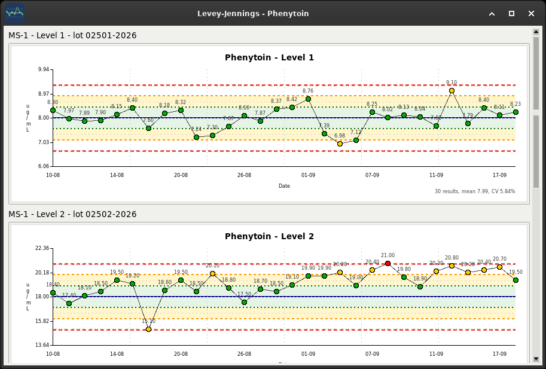

It is the answer to "is it the level or is it the method". A drift on one
level and not the other is one thing; the same drift on both is another.

### Total error

**QC > Total error** puts what the method does against what the analyte
allows.

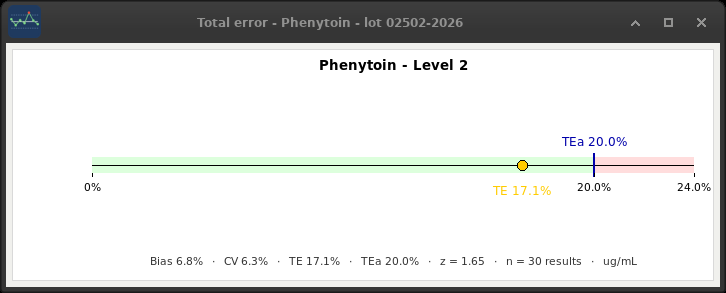

The green band is inside the allowable total error, the red band beyond it.
The dot is where this series sits, computed from its bias and its CV with the
coverage factor from the settings. The line below gives the numbers.

A method that sits close to the line is not failing, but it has nothing left:
the next reagent lot, the next calibration, and it will be over.

### Youden

**QC > Youden** puts the two levels of the same control against each other,
one point per day on which both were run.

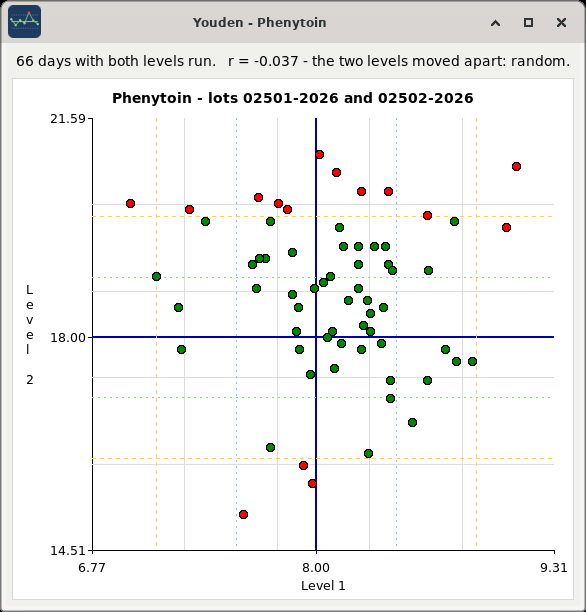

The shape is the answer. Points strung along the diagonal - both levels high,
or both low, on the same days - is a **systematic** error: a calibration, a
reagent lot, the instrument. Points scattered in a cloud with no direction is
**imprecision**.

Green is a day where both levels were inside 2 SD, red a day where at least
one was not.

The line above the plot gives the same answer as a number: Pearson's **r**
between the two levels, and whether it is above the threshold in the
settings. Near 1 the two moved together and the error is systematic; near 0
they moved independently and it is imprecision. The picture and the number
say the same thing, and the number is the one that can be written down.

### Bland-Altman

**QC > Bland-Altman** compares two instruments on the same control material:
the mean of the two against their difference, with the mean difference and
the limits of agreement at ±1.96 SD.

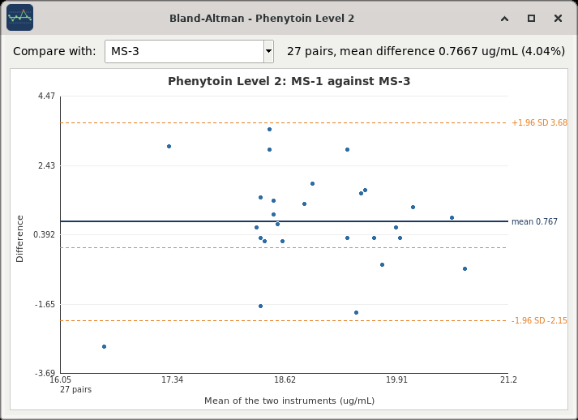

It is the question of the morning a new instrument arrives, and the one asked
whenever the same analyte is reported from two benches. A mean difference
that is not zero is a bias between the two; a spread that widens with the
concentration is a proportional difference and not a constant one.

The box at the top chooses which instrument to compare with.

## Everything at once

**QC > Performance** is the whole laboratory in one list: every lot with
results in the period, worst first.

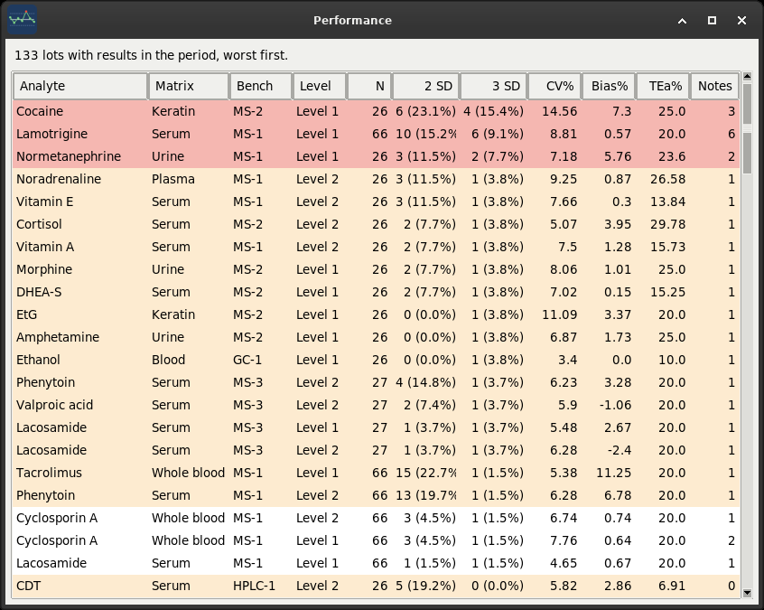

For each one: how many results, how many beyond 2 SD and beyond 3 SD with the
percentage, the CV, the bias, the allowable total error and how many notes
were written. Red is a lot with violations, orange one with warnings, white
one with neither.

This is where the morning starts when the laboratory is large enough that
looking at every chart is not possible. The first ten rows are the ones worth
opening.

## The notes

**QC > Notes** is the log of everything written about the results over the
period: the date, the analyte, the bench, the level, the value, the action
taken, the note and who wrote it.

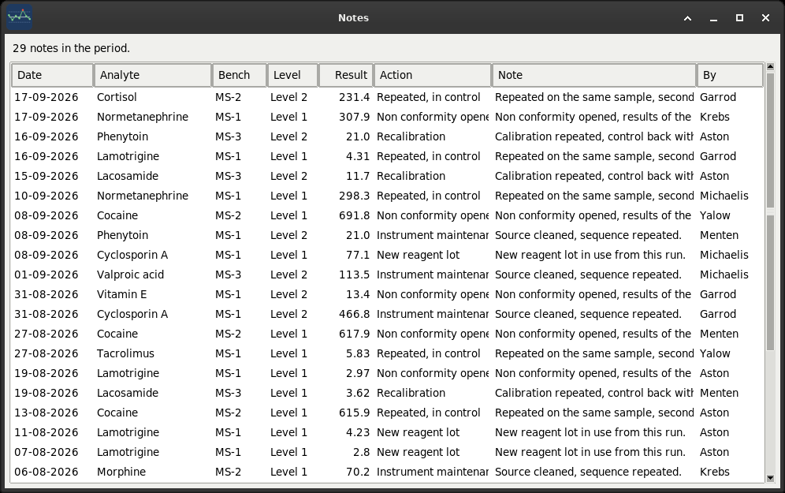

It is the non conformity log, and it is the document that answers "show me
what you did about it".

# External quality assessment

Everything up to here is the laboratory against itself. The target on every
chart is one the laboratory set, from the insert of a box or from its own
results, and that is the limit of what internal control can say: whether the
method is doing today what it did yesterday. It cannot say whether what it
does is right. A method can sit perfectly in control, for six months, on a
mean that moved — and no Levey-Jennings chart will ever mention it, because
the mean it is drawn against is the one that moved.

A proficiency scheme is the other half, and ISO 15189 asks for both. The same
material goes to every participant, the value is assigned from outside, and
what comes back says how far this laboratory fell from it.

**QC > External quality.**

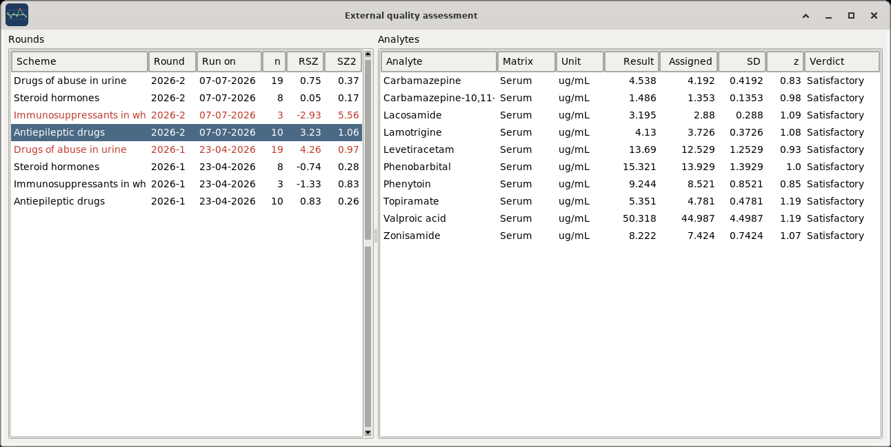

## A round, and what is typed into it

The rounds are on the left, newest first. The right button gives **New
round**; double clicking one opens it again. A round is a scheme, a name —
the scheme's own, usually a year and a number — and two dates: **Run on**,
the day the sample was measured, which is the day the performance belongs to,
and **Reported**, the day the report came back, which is weeks later.

Choosing a round lists its analytes. The right button there gives **Add
analyte**; double clicking one opens it. Three numbers are typed for each:

| Field | What the report calls it |
|---|---|
| **Result** | what this laboratory sent in |
| **Assigned** | the value the scheme assigned: a consensus of the participants, a reference method, or the way the material was made |
| **SD** | the standard deviation the scheme judges by |

That last one is the one to be careful with. It is **not** the spread of the
participants: it is the target standard deviation for proficiency
assessment - sigma-pt in ISO 13528 - which is a decision about what a result has
to be worth to be fit for purpose. The report says what it is. When a report
gives a target CV instead, the SD is the assigned value times that CV over a
hundred.

The z score is not typed and is not stored:

```
z = (result - assigned) / SD
```

It follows from the three numbers, and a stored copy could disagree with
them.

## Reading one analyte

| z | |
|---|---|
| under 2 | satisfactory |
| 2 or more | questionable, shown in orange |
| 3 or more | unsatisfactory, shown in red |

Those are ISO 13528's thresholds, read on the size and not on the sign: two
standard deviations out is two standard deviations out either way.

## Reading a whole round

Under the analytes, and in the two columns on the right of the rounds list,
are the scores that read the round as one thing. They answer different
questions and both are needed.

```
RSZ = sum(z) / sqrt(n)      are we out on the same side, on everything?
SZ2 = sum(z squared) / n    how far out are we, whichever side?
```

**RSZ keeps the sign**, so pluses and minuses cancel. A laboratory scattered
either side of the assigned values comes out near zero however wide the
scatter; a laboratory that reads a little high on everything does not. That
is a bias of the **laboratory** rather than of any one method — a calibrator,
a weighing, a way of working — and there is nothing in internal quality
control that can see it.

**SZ2 squares**, so nothing cancels. It is the size of the misses whichever
way they went, which is imprecision, and a single badly wrong analyte raises
it while leaving RSZ where it was.

The sample database has the case worth studying. Open the *Drugs of abuse in
urine* round of 2026-1: nineteen analytes, **every one of them
satisfactory** — the worst z in the round is 1.19 — and the round's RSZ is
4.26. Nineteen analytes all reading about one standard deviation high. No
chart in this program and no single z score can find that, and it is the
reason the second half of quality exists.

## What this does not do

It does not compute anything from the internal control, and it must not. The
whole value of a proficiency score is that nothing in it comes from the
laboratory's own target; the two halves are kept apart on purpose.

It does not download reports, and there is nothing to import: the numbers are
typed from the report as it arrived. A round is a few minutes, four times a
year.

## The schemes

**Edit > Proficiency schemes**, for an administrator. A scheme is a name and
its organiser, from the suppliers.

# The period

The **Period** menu decides how far back the program looks: last month, last
3, 6 or 12 months, all of it, or **Since...** for a day chosen.

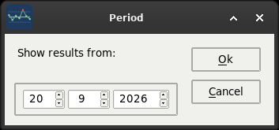

The choice is remembered, so the program opens where it was left.

**What the period governs and what it does not.** The lists, the comparisons
and the exports use the period. The chart and the statistics do not: they use
the last N results, whatever period they fall in.

That is deliberate. Westgard rules are read on a number of observations;
whether those thirty results took three weeks or three months does not change
the rule. A control run four times a day would give a chart of ninety points
over a month, and a control run twice a week would give a series that a
three-month cut turns into `NED` while its thirty points sit just behind the
cut. The status bar shows both numbers, because they answer different
questions.

# Records and exports

Under the **Exports** menu. The spreadsheets open in whatever the system uses
for them; the PDFs open in the PDF reader.

## The controls of a day

**Exports > Controls of a day**.

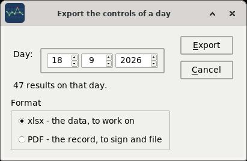

Choose the day - it says how many results it holds before anything is
produced - and the format.

**xlsx** is the data, to work on: every control run that day, with its
series, its z score and the rule read on it.

**PDF** is the record, to sign and file. It carries the laboratory, the day,
the operator, the version of the program and the statistical settings it was
computed with, the list of results with the rule each one closes, the
mandatory methods that were **not** controlled that day, and a signature
line.

That last part matters. A record that says what was run is half a record; the
one that says what should have been run and was not is the one that can be
audited. An analyte is marked as controlled every day in its test method -
the **Every day** box.

## The others

**Exports > Notes** - the non conformity log of the period, as a spreadsheet.

**Exports > Counts** - how much control was run, per analyte and per bench,
over the period. The answer to "are we controlling this enough".

**Exports > Analytical goals** - the goals of every method as they stand, as
a PDF. It is the document that goes with the procedure: it is read, checked
against its sources and filed, and never rearranged, which is why it is not a
spreadsheet.

# Master data

The **Edit** menu, for an administrator only. Every list works the same way:
**Add**, **Edit**, **Close**, double click to edit, and a row taken out of
use goes grey rather than disappearing.

| List | What it holds |
|---|---|
| **Analytes** | the substances measured, by name |
| **Categories** | the panels analytes are grouped in |
| **Controls** | the control materials, by manufacturer and product |
| **Corrective actions** | what can be done about a result out of control |
| **Instruments** | the benches of this laboratory |
| **Methods** | the analytical methods - LC-MS/MS, GC-MS, HPLC |
| **Models** | instrument makes and models |
| **Samples** | the matrices - serum, urine, whole blood, keratin |
| **Test methods** | an analyte as this laboratory measures it |
| **Suppliers** | who the control material comes from |
| **Units** | the units of measurement |
| **Users** | who may log in |

## Test methods

This is the important one. An analyte says what substance; a test method says
how it is measured here, and what the result has to be worth.

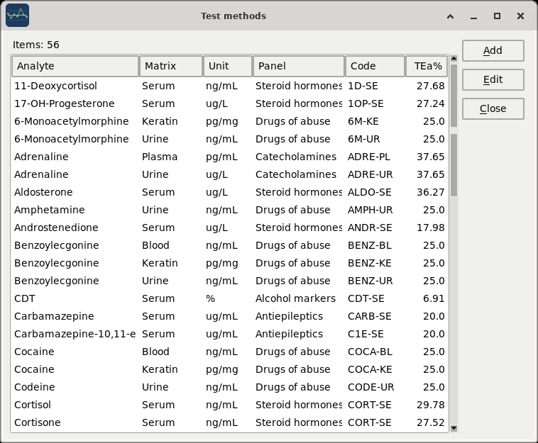

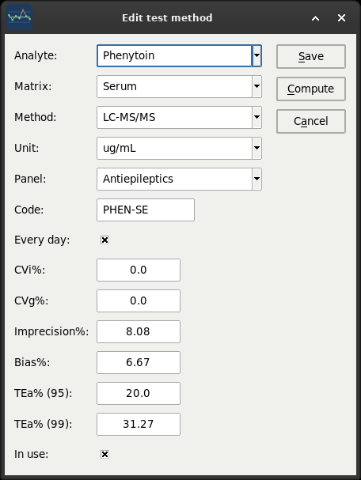

The first fields identify the method: the analyte, the matrix, the analytical
method, the unit, the panel it is reported in, and a short code.

**Every day** marks a method the laboratory controls on every working day.
The day's PDF lists the ones marked that were not controlled.

The rest are the analytical goals, and they come two ways because they are
two different things.

**An endogenous analyte** - cortisol, adrenaline, vitamin E - is held to its
own biological variation. Type **CVi%** (within-subject) and **CVg%**
(between-subject) from the EFLM database - the **?** menu opens it - and
press **Compute**. The program fills the rest by the EFLM formulae:

```
imprecision = 0.5 x CVi
bias        = 0.25 x sqrt(CVi^2 + CVg^2)
TEa         = z x imprecision + bias
```

with the coverage factor from the settings.

**A drug** - phenytoin, tacrolimus, cocaine - has no biological variation
worth the name: the concentration is what the dose made it. Leave CVi and CVg
at zero and type the **TEa%** directly, from the state of the art - a
proficiency scheme, a regulatory limit, the laboratory's own specification.
Compute refuses in that case rather than inventing a number, and says why.

`documents/ANALYTICAL_GOALS.md` has the formulae, the grading of the
estimates and where each number in the sample laboratory came from.

## Users

Two roles.

**Administrator** may do everything, including the Edit menu, the master data
and the users.

**Technician** enters results, writes notes, opens and closes lots, reads
every chart and produces every export. That is the whole daily work; what is
withheld is the master data.

A user taken out of use cannot log in and keeps everything they entered - the
audit trail still names them.

Anyone can change their own password: **File > Change password**. Passwords
are stored as bcrypt hashes; nothing in the database ever holds a password.

# Settings

**File > Settings**.

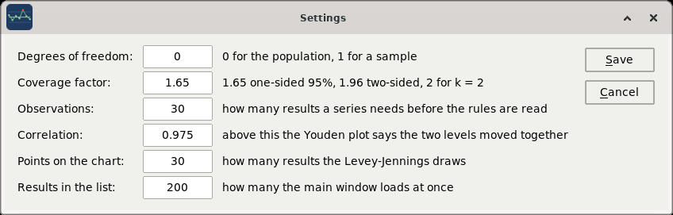

| Setting | What it changes |
|---|---|
| **Degrees of freedom** | 0 treats the series as the population, 1 as a sample. It changes every SD, CV and bias in the program |
| **Coverage factor** | z: 1.65 for one-sided 95%, 1.96 for two-sided 95%, 2 for k=2. It changes the total error and the uncertainty |
| **Observations** | how many results a series needs before the rules are read at all. Below it, `NED` |
| **Correlation** | above this r, the Youden plot calls the two levels agreed |
| **Points on the chart** | how many results the Levey-Jennings draws |
| **Results in the list** | how many the main window loads at once |

These are not cosmetic. Two laboratories with the same data and different
degrees of freedom publish different CVs. Set them once, with whoever signs
the procedure, and leave them; the status bar shows them so that nobody reads
a number without them.

# The database

Everything is in one file. Where it is: **?** menu, **About**, which prints
the path the program actually opened.

Which file it opens is decided in `biovarase.ini`, and **File > Configuration
file** opens that in whatever the system uses for text, so it can be found
without hunting for the folder the program was installed in:

```
[database]
file = sql/biovarase.sl3
```

A bare name is taken beside the program; an absolute path is taken as it is,
which is how the file comes to live on a shared folder or on another disk.
The program reads it once, at start-up, so a change takes effect the next
time it is started.

The same file holds whose laboratory this is - the `[laboratory]` section,
which is what the title bar and the status bar read - and the six settings
the Settings window also edits. Everything in it is commented.

## Backup

**File > Database > Backup** copies the file, named after the moment it was
taken, into `sql/bks`. It uses SQLite's own backup, which is consistent even
if something is writing while it runs.

It is the cheapest safety there is and the one that matters most. The
database is one file, so a copy of it is the whole laboratory.

**Do it every day.** It takes a second.

## Dump

**File > Database > Dump as SQL** writes the whole database out as SQL
statements. A copy of the file is what gets restored; a dump is what can be
read, searched and, if it ever comes to that, loaded into a version of SQLite
that no longer opens the file.

## Check

**File > Database > Check** asks the database whether it is still sound. If
the answer is not `ok`, restore the most recent backup - and read the
warning below.

## Vacuum

**File > Database > Vacuum** rebuilds the file, leaving out the space that
deleted rows left behind. It asks first, because it reads and writes the
whole file, and over a network that is every page across the wire.

## A warning about shared folders

SQLite on a folder shared over the network - SMB, NFS - is the one
arrangement its own documentation advises against. File locking over a
network is not reliable, and two computers writing at the same moment can
corrupt the file with nothing to warn either of them. `biovarase.ini` says so
where the path is set.

It is nevertheless how a small section with three or four benches works, and
the program is built to be used that way. If you do:

- take the backup **every day**, and keep more than one;
- run **Check** now and then;
- watch the lamp in the status bar.

One computer with the file on its own disk is safer. It is also less
convenient, and that is the trade the laboratory makes, not the program.

# Looking inside the database

Everything the program knows is in one SQLite file, and SQLite ships with a
shell that reads it. Nothing in this chapter is needed for the daily work;
it is here because a laboratory that cannot look at its own data is trusting
a program it cannot check.

```
sqlite3 -init sql/console.sql sql/biovarase.sl3
```

`-init` takes the place of the machine's own `~/.sqliterc` for that session,
so the shell behaves the same everywhere: foreign keys on, as the program
runs them, headers and columns on, and a first line that counts what is in
the file. It never writes anything.

Four queries worth keeping live in `sql/dql/`, one to a file, each with a
comment saying what it answers and what it takes:

| File | What it answers |
|---|---|
| `lots_in_use.sql` | which lots are open, on what, with how many results |
| `series_of_lot.sql` | the results of one lot, in order |
| `out_of_control.sql` | the results beyond the limits over a period |
| `history_of_result.sql` | everything that happened to one result |

They are run with `.read`:

```
.read sql/dql/lots_in_use.sql
```

`sql/statement.sql` is the scratch pad - the statement being worked on right
now. When one earns its keep it moves to `sql/dql/` and gets a name.

The schema itself is `sql/ddl/001_schema.sql`, and it is meant to be read:
eighteen tables, the six triggers of the audit trail, and a comment over
every decision that is not obvious.

# The audit trail

Every result and every lot is written twice: once into its own table, and
once into `audit_results` or `audit_batches` - the values as they were, the
operation, who did it and when.

It is done by six triggers inside the database, not by the program. That is
the point: they fire on any insert, update or delete, including one typed
into `sqlite3` by hand at midnight. Nothing in the application can be made to
skip them, and nothing has to remember to call them.

**From the program: QC > History**, or the right button on a result. It
shows the same thing, and it is the way to read it at the bench.

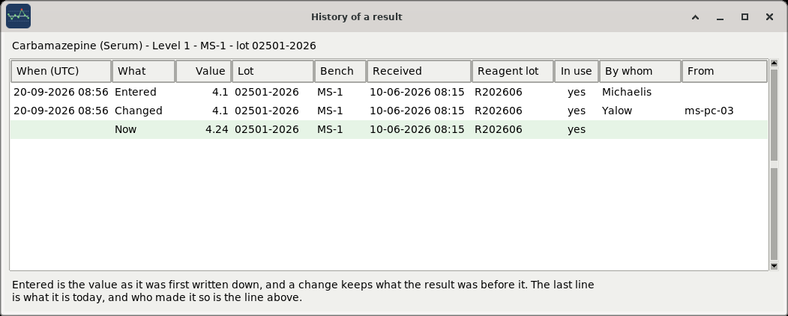

Each line is a state the result was in. **Entered** is the value as it was
first written down; **Changed** keeps what the result was *before* that
change, which is what the trigger stores; and the last line, on green, is
what it is today. Who made the last change is the line above it.

The lot is on every line, so a result moved from one lot to another shows as
a move rather than as nothing having happened. **In use** says whether it
counted at that moment.

The times are the database's own, and SQLite writes them in UTC - an hour or
two from the clock on the wall, depending on the season. They are shown as
they are stored: a record that says when something happened must not change
its answer depending on which side of a daylight saving change it is read
from.

**From the shell**, which shows exactly the same rows:

```
sqlite3 -init sql/console.sql sql/biovarase.sl3
.read sql/dql/history_of_result.sql
```

which gives, oldest first, what the result was at each step, what was done
to it and by whom:

```
log_time             operation  result  status  by_whom
2026-09-14 07:05:11  INSERT     20.8    1       Krebs
2026-09-14 09:20:43  UPDATE     20.4    1       Krebs
2026-09-15 08:02:17  UPDATE     20.4    0       Aston
```

A value corrected the same morning, and the result excluded the next day by
somebody else.

SQLite has no `CURRENT_USER`, so the login writes who is working into a
one-row `session` table and the triggers read it from there. It is in the
open, in `sql/ddl/001_schema.sql`, where it can be read.

What this gives the laboratory: for any result, the whole history of what it
was before every correction, when it was excluded and by whom, and which lot
it was moved from. That is what ISO 15189 means by records, and it is the
reason nothing in this program deletes anything.

# When something goes wrong

**Every error is written to the log.** `biovarase.log`, beside the program;
**File > Log** opens it. An error the program catches shows a message with the
path of the log at the bottom, and the log has the traceback.

**The lamp is red.** The database cannot be reached. If the file is on a
shared folder, the folder is probably not mounted. Nothing is lost: put it
back and the lamp turns green at the next heartbeat, within thirty seconds.

**A series says NED.** It has fewer results than the observations asked for
in the settings. Nothing is wrong; there is not enough to read a rule on yet.

**The mean is not what it was yesterday and nothing was entered.** Check the
degrees of freedom in the settings, and check whether a result was excluded.
The line under the chart says how many results the statistics used.

**An analyte is not in the Tests box.** Either its test method is out of use,
or it has no lot open on any instrument - the Tests box only offers what can
actually be looked at.

**A result cannot be found in the list.** The list shows the period. Widen it
from the **Period** menu, or use **Since...**.

For anything else, the trace shows what the program is doing while it does
it:

```
python3 biovarase.py --trace
```

# Appendix A: the sample laboratory

The program ships with a real laboratory that has invented numbers in it: the
mass spectrometry section of the Clinical Biochemistry and Molecular Biology
Unit at Sant'Andrea University Hospital in Rome, set up the way it actually
is. The panels are the ones it reports, the matrices are the ones it
receives, the instruments are the ones on the bench and the methods are the
ones written in its procedures - therapeutic drug monitoring,
immunosuppressants, steroid hormones, vitamins, catecholamines, alcohol
markers and drugs of abuse, on two mass spectrometers, a chromatograph and a
gas chromatograph with a headspace sampler. 44 analytes, 56 methods over
seven matrices, 133 lots, 8348 results over six months.

The data is what is invented. The concentrations are the ones those analytes
are really controlled at, and the lots behave as lots do, but nothing in
that file was measured: it was generated, so that a database could be
shipped without shipping a laboratory's own. The people are invented as
well, and are people no longer here to mind: Francis Aston, Hans Krebs, Maud
Menten, Leonor Michaelis, Rosalyn Yalow, Archibald Garrod. Everybody's
password is `pass`.

Four series have something wrong with them on purpose, because a program for
quality control whose sample data is all in control teaches nothing:

| Analyte | What was done to it | What it comes out as |
|---|---|---|
| Phenytoin | a calibration drifting for three weeks | `4:1S` |
| Tacrolimus | a mean that moved and stayed there | `10:X` |
| Lamotrigine | imprecision quietly getting worse | `1:2S` |
| Valproic acid | one bad morning | `1:2S` |

Three results were corrected and one was withdrawn as a duplicate, so
**QC > History** has something to show; and of the four proficiency schemes
and their eight rounds, one has every analyte satisfactory and a laboratory
bias the analytes cannot show.

They have the notes that were written about them. Open the phenytoin, level
2, on the first instrument, and read the chapters above against it.

To start again from the data as it shipped:

```
rm sql/biovarase.sl3
sqlite3 sql/biovarase.sl3 < sql/biovarase.sql
```

# Appendix B: gestures and keys

| Where | Gesture | What it does |
|---|---|---|
| Batches list | double click | enter a result on that lot |
| Results list | double click | write a note on that result |
| Results list | right button | Edit result / Note / History |
| Chart | double click a point | open that result |
| Batches window, analyte | double click | open a new lot on it |
| Batches window, lot | double click | edit the lot |
| Any list | double click a row | edit it |

Every button in every window has an underlined letter, and **Alt** with that
letter presses it: **Alt-S** saves, **Alt-C** cancels, and so on. No two
buttons in the same window share a letter.

# Appendix C: the standards this follows

**ISO 15189:2022**, medical laboratories - requirements for quality and
competence: internal quality control, the records of it, and the traceability
of who did what.

**ISO/TS 20914:2019**, practical guidance for the estimation of measurement
uncertainty: the expanded uncertainty the Performance box reports.

**EFLM Biological Variation Database** - the **?** menu opens it - for the
within-subject and between-subject variation the analytical goals are
computed from, and the grading of each estimate.

**Nordtest TR 569**, *Internal Quality Control - Handbook for Chemical
Laboratories*, the Trollbook, also in the **?** menu. Written for chemical
laboratories rather than clinical ones, and the better for it: it starts
from what the control material is and ends at the chart, with the arithmetic
in the open. The Istituto Superiore di Sanita published an Italian
translation of the fourth edition as Rapporti ISTISAN 12/29; the English is
now at edition 6.

**Westgard multirules**, as in *Basic QC Practices*: the six rules and the
order they are read in.

**ISO 13528:2015**, statistical methods for use in proficiency testing by
interlaboratory comparison: the z score, the two combined scores, and the
thresholds all three are read against.

The program implements them. Deciding that what it computes is fit for the
laboratory's purpose is the laboratory's job, and this manual does not
replace the procedure that says so.

---

Biovarase is free software under the GNU GPL, version 3 or later.
Source: <https://github.com/1966bc/biovarase>
